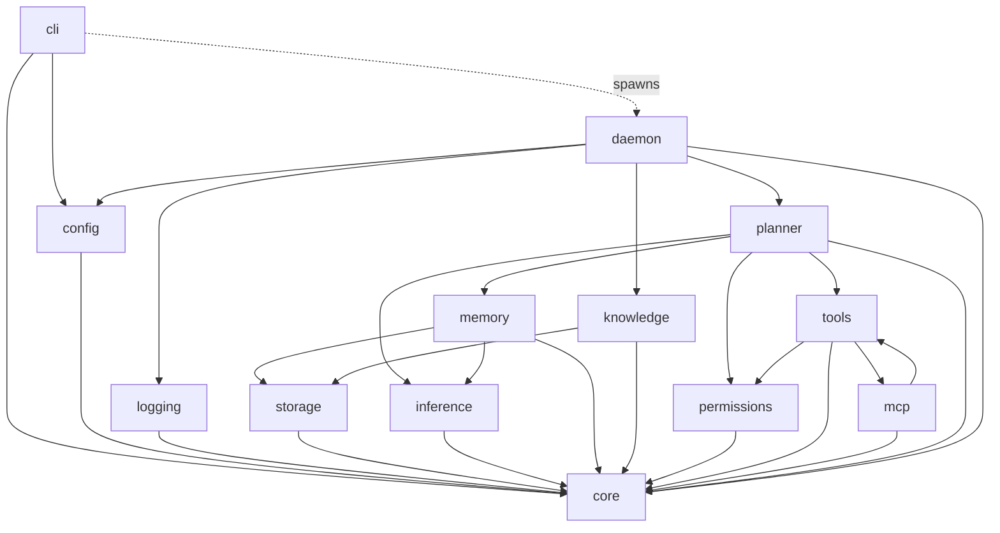
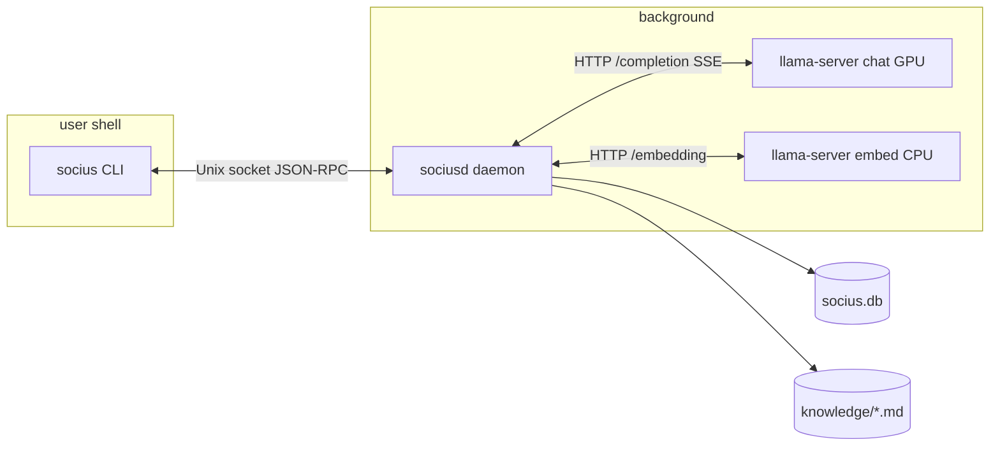
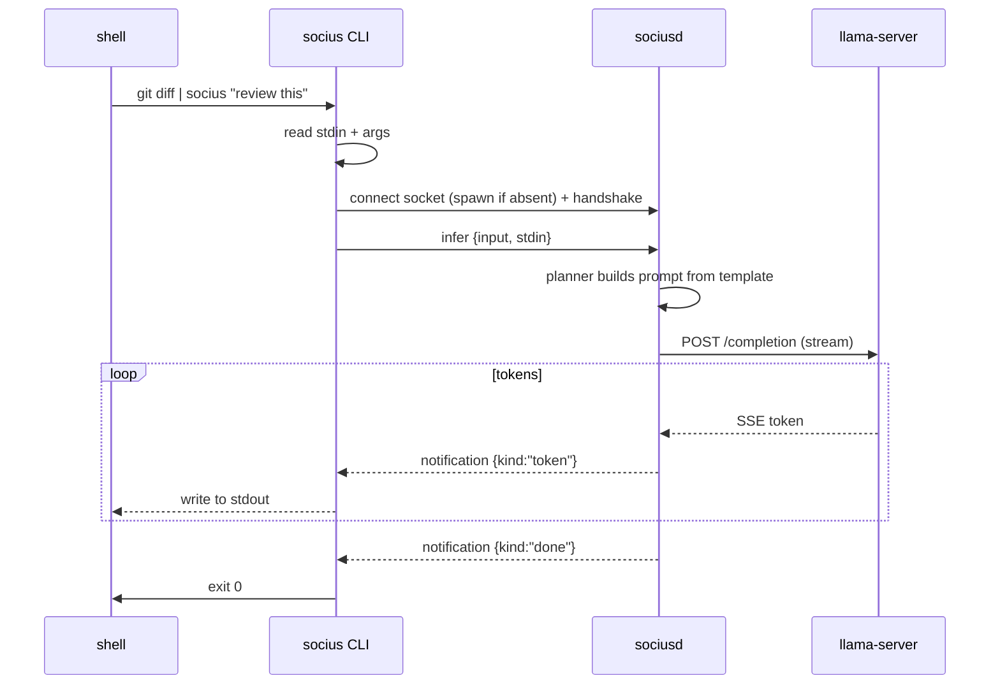

# 01 — Architecture

## Module map

Socius is a Bun monorepo of small, single-responsibility packages. The rule that keeps it
coherent at 100k+ LOC: **every package depends only on `@socius/core`'s interfaces, never on a
sibling's implementation.** `core` has zero runtime dependencies.

```
packages/
  core         Contracts: types + interfaces + errors. No runtime deps.
  config       Layered TOML config, XDG paths, validation.
  logging      Structured logger + reasoning-trace sink.
  storage      SQLite (bun:sqlite) + sqlite-vec + FTS5, migrations, repositories.
  inference    InferenceBackend + Embedder — the llama.cpp adapter.
  memory       Retrieval-first memory subsystem.
  knowledge    The Markdown knowledge base + its derived index.
  permissions  Capability model + policy engine.
  tools        Unified Tool interface + registry + native tools.
  mcp          MCP client; wraps remote tools as native Tools.
  planner      Deterministic state-graph planner.
  daemon       sociusd: owns the model, wires everything, serves IPC.
  cli          socius: thin client (arg/stdin parsing, streaming, spawn).
apps/
  gui          (M5+) React UI over the same daemon/IPC. Deferred.
```

## Dependency graph

Arrows mean "depends on." There are no cycles; everything points down toward `core`.



Why this shape: the planner is the hub of *behavior*, but it only knows the **interfaces** of
tools, memory, inference, and permissions. Any of those can be reimplemented or mocked (see the
LLM test double in [`14-testing.md`](./14-testing.md)) without the planner noticing. `core` at
the bottom is the contract everyone agrees on.

## Runtime topology

Two processes at rest, plus model children the daemon manages:



The CLI holds no intelligence; it is I/O and process management. The daemon owns everything
stateful and keeps the model warm so commands feel instant. See [`02-process-model.md`](./02-process-model.md).

## A request's life (the M1 "pipe-to-reason" path)



Later milestones insert **retrieve → plan → confirm → tool_call → reflect** nodes between
"handshake" and "completion," but the transport, streaming, and process model are identical —
which is exactly why we build this slice first.

## Data flow and ownership

- **Canonical data** lives in files you own: `~/.local/share/socius/knowledge/**.md` and one
  SQLite database `~/.local/share/socius/socius.db`.
- **Derived data** (vector embeddings, FTS index) lives in SQLite and is rebuildable from the
  Markdown at any time. Losing the DB is recoverable; losing your Markdown is not — so Markdown
  is the source of truth.
- **Config** is hand-editable TOML in `~/.config/socius/`. **Runtime** artifacts (socket,
  pidfile) live on tmpfs in `$XDG_RUNTIME_DIR`. See [`10-config.md`](./10-config.md).

## Why a monorepo (ADR-0007)

- **Why:** atomic cross-cutting changes (touch an interface in `core` and all consumers in one
  commit/PR), one toolchain, trivial local linking via Bun workspaces.
- **Alternatives:** polyrepo (one repo per package); a single flat package.
- **Tradeoffs:** monorepo needs project-reference discipline to keep build times sane; we accept
  that for the atomic-change benefit. A flat package would be simpler now but erode the module
  boundaries that Principle #6 depends on — the boundaries are the point.
- **Rejected polyrepo** because the interface churn in early years would make coordinated changes
  across many repos painful, and there is a single maintainer/small team.
