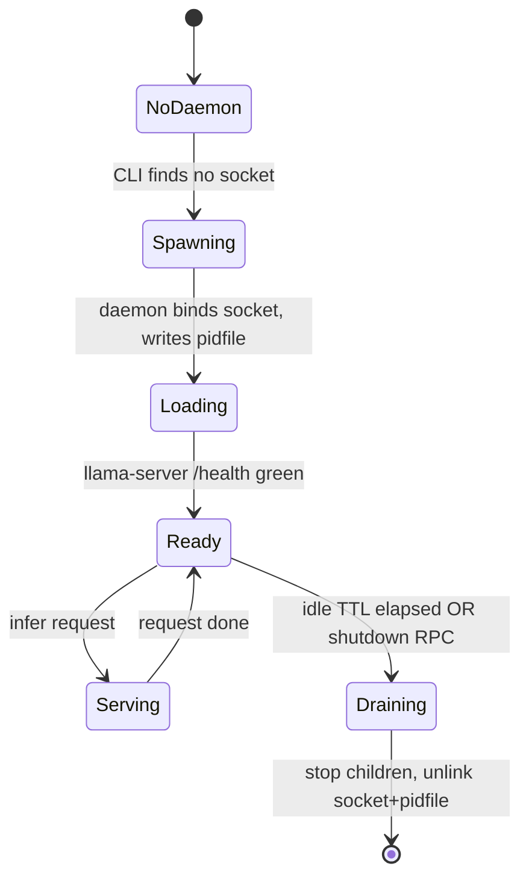
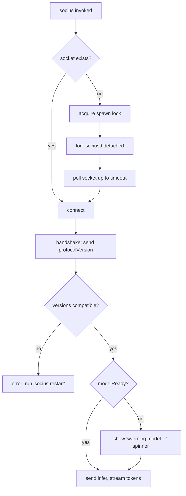

# 02 — Process Model

> Canonical decision: [ADR-0001](./adr/0001-hybrid-daemon.md).

## The problem

Socius must "feel like grep": you type `git diff | socius "review this"` and it responds
immediately. But the reasoning model is ~3 GB of weights that take 3–8 seconds to load into
VRAM. If every invocation loaded the model, the tool would be unusable. Something must hold the
model resident between commands.

## The decision: hybrid lazy-spawned daemon

- A long-running daemon, **`sociusd`**, holds the model resident and owns all stateful
  subsystems (memory, planner, tools, permissions).
- A thin client, **`socius`**, does I/O only. On each invocation it connects to the daemon's
  Unix socket. **If the socket is absent, the CLI spawns the daemon**, waits for a handshake,
  then proceeds.
- The daemon **idle-shuts-down** after a configurable TTL (default 30 min) so it does not hold
  VRAM/RAM hostage on an idle laptop. The next command transparently respawns it.
- An optional systemd user unit can keep it always-on for users who prefer zero first-call
  latency.

This gives warm-model latency in the common case, zero resource cost when idle for a long time,
and no manual "start the server" step.

## Lifecycle

### Startup sequence (daemon)
1. Acquire an exclusive lock on a lockfile (guards against two daemons racing to spawn).
2. Load and validate config ([`10-config.md`](./10-config.md)).
3. Bind the Unix socket at `$XDG_RUNTIME_DIR/socius/sock`; write `sociusd.pid`.
4. Open SQLite, run migrations ([`11-storage.md`](./11-storage.md)).
5. Spawn `llama-server` (chat, GPU) and the embedder `llama-server` (CPU); wait for `/health`.
6. Start the idle timer. Announce `modelReady` on the next handshake.

### Shutdown sequence
1. Stop accepting new requests; let in-flight ones drain (bounded grace period).
2. SIGTERM the `llama-server` children; wait, then SIGKILL if needed.
3. Checkpoint SQLite (WAL), close the DB.
4. Unlink the socket and pidfile. Exit 0.

Triggered by: idle TTL, an explicit `socius shutdown`, or SIGTERM/SIGINT.

## The connect-or-spawn dance (CLI)

**Spawn-race handling.** Two shells could invoke `socius` simultaneously with no daemon running.
Both would try to spawn. A `flock` on a lockfile in `$XDG_RUNTIME_DIR` serializes this: the
loser waits for the winner's socket instead of spawning a second daemon.

**Crash recovery.** If the CLI connects but the socket is dead (stale file after a crash), it
detects the failed handshake, unlinks the stale socket/pidfile, and respawns. The pidfile lets
`socius doctor` distinguish "daemon healthy" from "stale artifacts."

## IPC protocol

Transport: **newline-delimited JSON-RPC 2.0 over a Unix domain socket.** Requests get responses;
streaming (tokens, steps, confirmation prompts) arrives as server-initiated notifications.

The protocol version is exchanged in the handshake (`IPC_PROTOCOL_VERSION`, currently `0`). A
stale CLI talking to a newer daemon **fails loudly** with `IPC_PROTOCOL_MISMATCH` rather than
misbehaving — this matters once the tool is installed system-wide and the two binaries can drift.

Methods (see `packages/core/src/ipc.ts`): `handshake`, `infer`, `cancel`, `shutdown`, `health`.
Notifications during `infer`: `token`, `step`, `confirm`, `done`.

### Why a Unix socket, not HTTP/gRPC (ADR-0001)
- **Why:** local-only, filesystem permissions give us access control for free (mode 0600, owned
  by the user), no port allocation, low overhead, trivially inspectable with `socat`.
- **Alternatives:** localhost TCP + HTTP; gRPC; a named pipe.
- **Tradeoffs:** a socket is Unix-only (fine — Socius targets Linux first; a Windows named-pipe
  transport can implement the same protocol later behind the transport interface). HTTP would
  add a framework and a port to secure for no benefit on a single machine. gRPC adds codegen and
  a schema compiler for a two-process, single-machine link — overkill.
- **Rejected TCP/HTTP** primarily for the free, correct access-control story of socket file
  permissions; a stray localhost port is an attack surface a companion holding your data should
  not open.

## Why not the alternatives

- **Ephemeral CLI only (no daemon):** rejected — 3–8 s model reload per command destroys the
  grep-feel, and Socius's own caches (retrieval, tool registry) would be cold every call.
- **Always-on daemon only:** rejected as the default — wastes VRAM/RAM on an idle 16 GB laptop.
  Offered as an opt-in systemd unit for those who want it.
- **Hybrid (chosen):** warm when you're working, gone when you're not, no manual start. The cost
  is lifecycle complexity (spawn races, handshake, crash recovery), which is contained in two
  well-tested modules.
