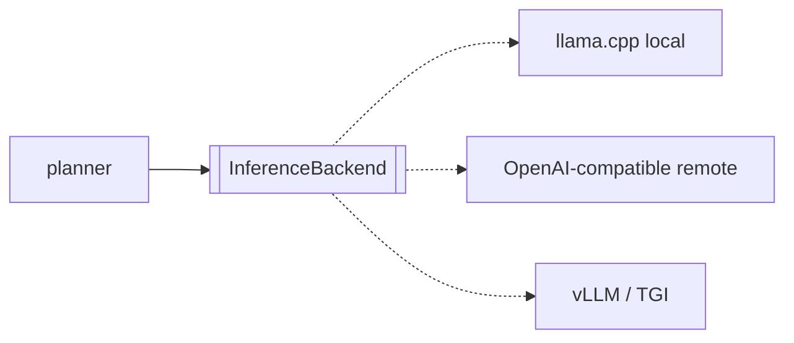

# 03 — Intelligence

> Canonical decision: [ADR-0002](./adr/0002-inference-backend.md).

Intelligence is the model layer, and it is deliberately the *thinnest* conceptual part of
Socius — everything above it is model-agnostic. Two capabilities, kept separate because on a
4 GB GPU they cannot share the card:

- **`InferenceBackend`** — chat/reasoning. Runs on the **GPU**.
- **`Embedder`** — text → vector. Runs on the **CPU**.

Interfaces: `packages/core/src/inference.ts`.

## The hardware reality that shapes this

The reference machine is an RTX 3050 Laptop with **4096 MiB of VRAM**. A Q4_K_M effective-4B
model is ~2.6–3.2 GB of weights plus a KV cache that grows with context. That fits — with a
*modest* context window and little headroom. The consequences are not optional:

1. **Chat and embedding models cannot co-reside on the GPU.** The embedder therefore runs on the
   CPU (a Ryzen 7 5800H embeds a few hundred short texts per second — plenty for memory writes
   and retrieval).
2. **Context is scarce.** Memory retrieval must be lean and token-budgeted; the planner must
   summarize aggressively. See [`04-memory.md`](./04-memory.md).

## The backend abstraction

```ts
interface InferenceBackend {
  complete(req: CompletionRequest): AsyncIterable<CompletionChunk>; // streaming
  countTokens(text: string): Promise<Result<number>>;
  contextWindow(): number;
  health(): Promise<BackendHealth>;
}
```

Adapter #1 is **llama.cpp over HTTP**. The daemon spawns and supervises `llama-server` as a
child process (see [`02-process-model.md`](./02-process-model.md)) and this adapter speaks its
`/completion` SSE stream. Keeping the C++/CUDA runtime **out of process** is a Principle #2 win:
a model segfault kills a child, not the daemon — the daemon health-checks and restarts it, and
meanwhile your notes and memory are still readable.

### Constrained decoding
`CompletionRequest.responseSchema` lets a caller demand JSON conforming to a schema. llama.cpp
supports GBNF grammars, so the adapter compiles a JSON Schema to a grammar and the model is
*physically unable* to emit malformed JSON. This is the backbone of the planner's "LLM fills a
typed slot" model — see [`06-planner.md`](./06-planner.md). If a future backend lacks grammars,
the adapter falls back to parse-and-retry.

## The embedder

```ts
interface Embedder {
  readonly dimensions: number;
  embed(texts: readonly string[]): Promise<Result<readonly Float32Array[]>>;
}
```

Implementation: a **second `llama-server` instance in `--embeddings` mode, pinned to CPU**, with
a small GGUF embedding model (bge-small class, 384-dim). It exposes `/embedding` over HTTP.

- **Why the same tech (llama.cpp) for embeddings:** one runtime to install, build, and reason
  about; one supervision story; no native Node addon to compile.
- **Alternative considered:** `fastembed`/`onnxruntime-node` — lighter memory, but adds a native
  dependency and a second inference stack. The `Embedder` interface makes swapping to it later a
  contained change if profiling justifies it.

## Swapping the model (Principle #6 in practice)

Replacing Gemma with another local GGUF is a **config change**, not a code change: point
`model.path` at a different file. Nothing above `inference` references "Gemma."

Switching to a bigger brain — a workstation GPU or a remote endpoint — is a *new adapter*
implementing `InferenceBackend`, selected by config:



This is also the escape hatch for the planner's biggest limitation: when a genuinely capable
model is available, an autonomous planner mode ([`06-planner.md`](./06-planner.md)) becomes
viable — behind the same interfaces, with no rewrite.

## What we deliberately do *not* do

- **No fine-tuning in the core product.** Personalization comes from memory + prompts + retrieval
  (inspectable, editable, portable), not from baked-in weights (opaque, tied to one model). A
  user could fine-tune and point config at their GGUF — the architecture is indifferent.
- **No hidden prompt engineering.** Every system prompt is a file in `promptsDir`
  ([`10-config.md`](./10-config.md)), versioned and inspectable (Principle #5).
