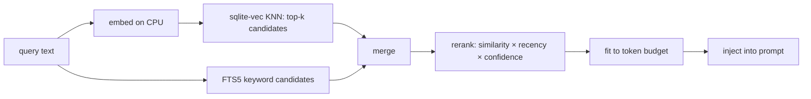

# 04 — Memory

> Canonical decision: [ADR-0003](./adr/0003-memory-retrieval.md).

Memory is **not** conversation history. It is the defining subsystem of Socius — the thing that
makes it a companion rather than a stateless prompt runner. Conversation history is just one
*kind* of memory, and a low-value one.

Interfaces: `packages/core/src/memory.ts`.

## Memory kinds

All kinds share one row shape discriminated by `kind`, not one table per kind. New kinds are a
new enum value, not a migration.

| Kind | Example | Typical source |
|------|---------|----------------|
| `conversation` | "Earlier you asked about the renderer bug." | chat |
| `working` | Scratch state for the current multi-step task. | planner |
| `project` | "Socius uses Bun + SQLite, no Postgres." | files, chat |
| `long_term` | "I prefer TypeScript over Python for tools." | promotion |
| `journal` | "2026-07-07: shipped the daemon skeleton." | user, knowledge |
| `knowledge` | A chunk of a Markdown note, indexed for retrieval. | knowledge base |
| `architecture_decision` | "Chose a Unix socket over HTTP for IPC." | ADRs, chat |
| `preference` | "Always show reasoning before running a tool." | user |
| `goal` | "Replace 90% of cloud-AI usage this year." | user |
| `workflow` | "Every morning: mail → calendar → git → todos." | user |

## The row shape

```ts
interface Memory {
  id; kind; content; source: { origin; ref? };
  confidence;                 // 0..1, decays and is reinforced
  tags; metadata;             // freeform, inspectable
  createdAt; updatedAt; accessedAt;
  // + embedding (stored in the vector table, not on the object)
}
```

Every memory is **inspectable and editable** (Principle #5) via `socius mem` — list, show, edit,
forget. There is no hidden state: what Socius "knows" about you is a queryable table.

- **`source`** gives provenance: was this from a file, a tool, or something you said? This lets
  you audit and lets retrieval weight trusted origins higher.
- **`confidence`** decays over time (half-life is configurable) and is reinforced on access or
  restatement. Stale, unreinforced memories sink in ranking rather than being deleted.

## The retrieval pipeline

The rule from Principle #4 and the 4 GB context ceiling: **never inject all memory; retrieve the
few most relevant and fit them to a token budget.**



1. **Embed** the query on the CPU embedder.
2. **Vector candidates:** `sqlite-vec` KNN returns the top-`k` (default 12) by cosine similarity.
3. **Hybrid keyword:** FTS5 catches exact terms (identifiers, error codes) that embeddings blur.
4. **Rerank:** a deterministic blend — `score = similarity × recencyDecay × confidence`. This is
   code, not a model call (Principle #4).
5. **Budget:** greedily take highest-scored memories until the token budget (default ~1024) is
   hit. Retrieval is *bounded*, so the prompt never blows the context window.

The blend weights and budgets are config, not hardcoded ([`10-config.md`](./10-config.md)), and
every retrieval is recorded in the trace ([`12-logging-observ.md`](./12-logging-observ.md)) so
you can see exactly which memories shaped an answer.

## Writing memory

Memory is written **deliberately**, not by dumping every message. Sources:
- Explicit: `socius remember "..."`, or the user telling Socius to remember something.
- Planner-driven: a `reflect` node may propose a memory (e.g. "the user prefers X"), which is
  stored with modest confidence and a `chat` source — never silently as ground truth.
- Knowledge indexing: Markdown notes are chunked and embedded as `knowledge` memories.

Deduplication and promotion (working → long_term) are deterministic policies in the memory
package, not model decisions.

## Storage

One SQLite database. A `memories` table for the rows, a `sqlite-vec` virtual table for
embeddings (keyed by memory id), and an FTS5 table for keyword search. See
[`11-storage.md`](./11-storage.md). Because `knowledge` memories are derived from Markdown, the
embedding tables are fully rebuildable from disk — losing the vector index is recoverable.

## Why retrieval-first, not "stuff the context" (ADR-0003)

- **Why:** a 4 GB model has a small context window; injecting everything is physically
  impossible and, even where it fits, drowns the signal. Retrieval keeps prompts small, fast,
  and relevant, and makes what-influenced-this-answer inspectable.
- **Alternatives:** (a) full-history-in-prompt; (b) a fine-tuned/personalized model; (c) a
  summary-only rolling memory.
- **Tradeoffs:** retrieval can miss relevant context if embeddings are weak — mitigated by the
  hybrid keyword pass and by tunable `k`. It is more moving parts than "paste it all in."
- **Rejected (a)** on hard context limits; **(b)** because weights are opaque, un-portable, and
  tie memory to one model (violates P5/P6); **(c)** because a lossy rolling summary silently
  forgets, and the user cannot inspect or correct what was dropped.
