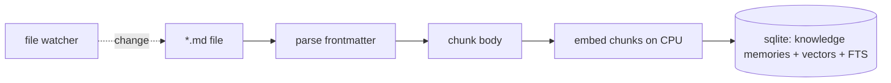

# 05 — Knowledge System

Everything important lives in **plain Markdown**. This is the durability guarantee behind
Principle #1: if Socius disappears tomorrow, `~/.local/share/socius/knowledge/` is still a
useful, portable, greppable folder of your notes.

Reference: `packages/knowledge/src/index.ts`.

## Layout

```
knowledge/
  projects/       one file (or folder) per project: decisions, status, links
  journal/        dated entries; the running log of what you did and decided
  notes/          general notes
  todos/          task lists (Markdown checkboxes)
  architecture/   design docs, ADR-style records for your own projects
  meetings/       meeting notes
  ideas/          half-formed ideas
  experiments/    things you tried, with outcomes
```

Each file has YAML frontmatter for structured fields, and Markdown for the body:

```markdown
---
title: Socius daemon design
tags: [socius, architecture, daemon]
project: socius
created: 2026-07-07
---

Decided on a hybrid lazy-spawned daemon because...
```

## Files are canonical; the index is derived

The SQLite database holds a **derived index** of the knowledge base — path, frontmatter, and
per-chunk embeddings (as `knowledge`-kind memories, see [`04-memory.md`](./04-memory.md)). The
files are the source of truth. The index is rebuildable from disk at any time
(`socius knowledge reindex`), so:

- You can edit notes in any editor; a file-watcher re-indexes on change.
- You can `git`-version your knowledge base independently of Socius.
- Losing `socius.db` loses no knowledge — only the cache that makes it searchable fast.

## Indexing pipeline



Chunking is deterministic (by heading and size); embeddings come from the CPU embedder. Retrieval
over knowledge uses the same pipeline as all memory — knowledge is not a separate search system,
it is memory sourced from files.

## Why Markdown-on-disk, not "everything in SQLite"

- **Why:** longevity and ownership. Markdown outlives the app, any single tool, and any model.
  It is diffable, git-friendly, and editable without Socius running.
- **Alternative:** store notes as rows in SQLite (like memory). Rejected for the *canonical*
  copy — a database is opaque to `grep`, `cat`, and your editor, and couples your notes' survival
  to Socius's schema. SQLite is the right home for *derived* structure, not for the human
  artifact.
- **Tradeoff:** two stores to keep in sync (files ↔ index). Mitigated by making the index purely
  derived and cheap to rebuild — sync is one-directional (files → index), so there is no
  conflict-resolution problem.
