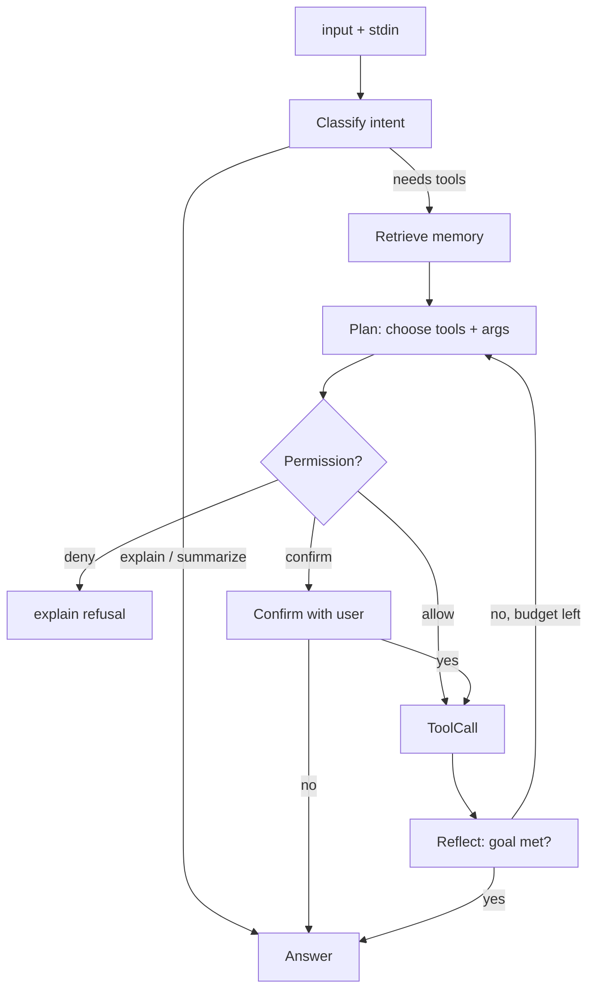

# 06 — Planner

> Canonical decision: [ADR-0004](./adr/0004-deterministic-planner.md).

The planner is where Socius stops being a prompt-runner and becomes a system. It decides whether
a request needs tools, memory, clarification, confirmation, reflection, decomposition, or
retries. But the crucial design choice is **who** decides: **code decides, the model advises.**

Interfaces: `packages/core/src/planner.ts`.

## The decision: a deterministic state graph, LLM-in-slots

The planner is a typed state machine / DAG written in TypeScript. The LLM is invoked only at
specific **slot nodes**, and only ever to answer a *narrow, schema-constrained* question:

- `Classify` — "which of these intents is this? (pick one)"
- `Retrieve` — deterministic memory fetch (no LLM)
- `Plan` — "which of these tools, in what order, with what args? (constrained JSON)"
- `Confirm` — deterministic permission gate + user prompt (no LLM)
- `ToolCall` — deterministic execution of a validated tool (no LLM)
- `Reflect` — "given this result, is the goal met? what's missing? (constrained)"
- `Summarize` — "compress this text" (free text, but bounded)
- `Answer` — stream the final response (free text)

Edges between nodes are **code**. The model never chooses "what to do next" from an open set;
it fills a labeled blank whose type the code defines and validates.

## Why not an autonomous agent loop

The obvious alternative is ReAct-style: give the model the tools and a `while` loop and let it
decide each step. It is less code and more "magical." We reject it as the default because:

- **A 4 GB local model is unreliable at long-horizon autonomy.** It hallucinates tool calls,
  loops, and loses the thread. That produces a flaky companion, and a flaky daily-driver gets
  uninstalled — the one outcome we cannot afford.
- **It violates Principle #4.** Control flow *is* traditional programming; handing it to a
  probabilistic model where deterministic code would do is exactly the anti-pattern the
  principle forbids.
- **It is not inspectable (Principle #5).** "The agent decided to…" is not a debuggable trace.
  A fixed graph with recorded `PlanStep`s is.

## Bounded recursion, not open loops

Decomposition and retries are supported, but **bounded**: a `Plan`/`Reflect` cycle has a
configurable depth cap and step budget. Exceeding it raises `PLAN_BUDGET_EXCEEDED` and the
planner degrades to answering with what it has, rather than spinning. There is no code path that
loops on model judgement without a hard ceiling.

## Slot contracts

Each slot node has a JSON Schema for its expected output. The inference backend constrains
generation to that schema via grammar ([`03-intelligence.md`](./03-intelligence.md)); on the
rare invalid output the node parses-and-retries once, then fails with `SLOT_OUTPUT_INVALID`
(which the graph handles — usually by degrading, never by crashing). Every slot call — prompt,
raw output, validated output, latency — is written to the reasoning trace.

This is what makes a small model *usable*: it is never asked to be smart about control flow,
only to make one small, checkable decision at a time.

## Tiered future: autonomy as an option, not the default

The `Planner` interface is deliberately just `run(ctx): AsyncIterable<PlanEvent>`. When a
capable backend is configured (a workstation GPU, a remote model), an `AutonomousPlanner`
implementing the same interface can be selected by config — earning its autonomy on a model that
can sustain it, without changing the daemon or the tools. The deterministic graph remains the
safe default and the reference implementation.

## M1 status

For M1 the graph is a single edge: `Answer`. `DirectPlanner`
(`packages/planner/src/index.ts`) streams the model's response to `input (+ stdin)` with no
memory or tools. This proves the transport, streaming, and prompt-template path end-to-end. The
node library (`Classify`, `Plan`, `ToolCall`, `Reflect`) lands in M3 behind the same interface.
