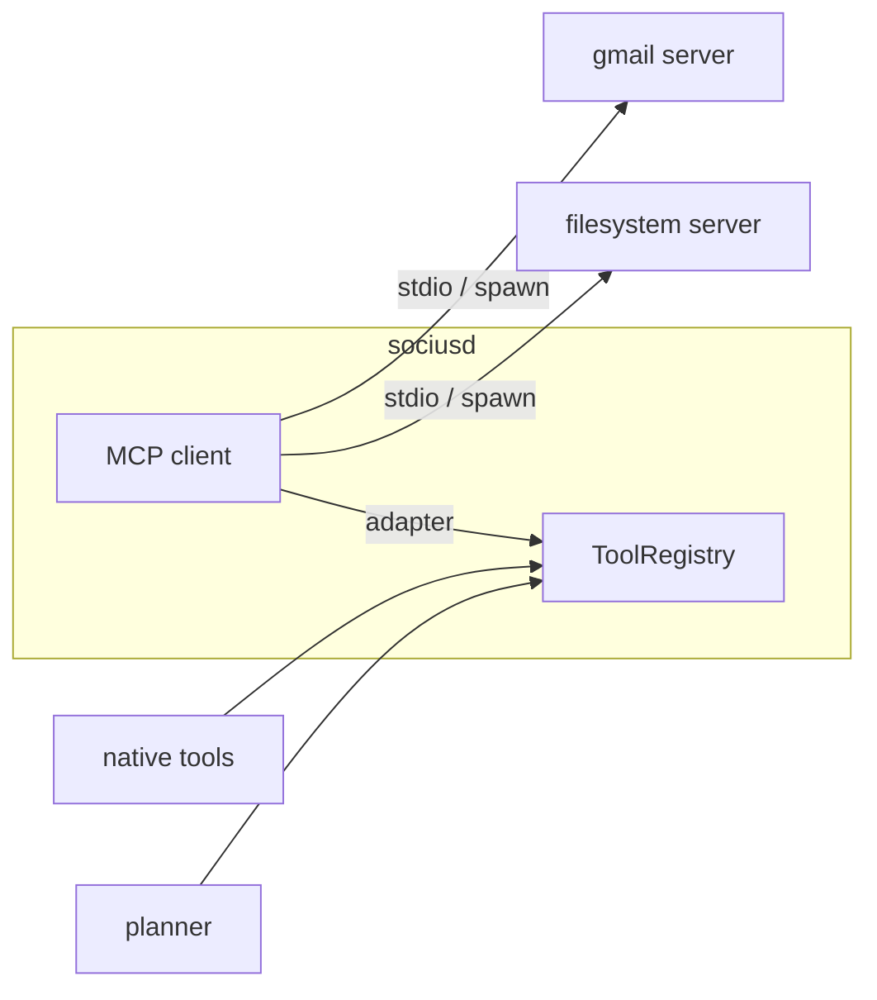

# 08 — MCP (Model Context Protocol)

MCP support is mandatory. Socius is an **MCP client**: it connects to MCP servers and exposes
their tools to the planner. The design goal is that **integrating a new MCP server is a config
change, not a code change**, and that MCP tools are indistinguishable from native ones.

Reference: `packages/mcp/src/index.ts`. Adopts the official
[`@modelcontextprotocol/sdk`](https://github.com/modelcontextprotocol).

## How it fits



Each configured server is spawned; the MCP client lists its tools; an **`McpToolAdapter`** wraps
each remote tool as a native `Tool` ([`07-tools.md`](./07-tools.md)) and registers it. From the
planner's perspective there is one flat registry of `Tool`s.

## Configuration

MCP servers are declared in config ([`10-config.md`](./10-config.md)):

```toml
[[mcp]]
name = "gmail"
command = "npx"
args = ["-y", "@some/gmail-mcp-server"]
enabled = true

[[mcp]]
name = "filesystem"
command = "mcp-server-filesystem"
args = ["/home/toeesh/Documents"]
enabled = true
```

Tools are **namespaced by server** to avoid collisions: `gmail/search_threads`,
`filesystem/read_file`. The namespace is the server `name`.

## Capability and permission mapping

An MCP tool's JSON Schema and declared side effects are mapped to Socius capabilities so the
permission layer governs them like any tool: a server that writes files is subject to the
`fs.write` policy; unknown or ambiguous effects default to `confirm`
([`09-permissions.md`](./09-permissions.md)). MCP tools do **not** get a privileged bypass — the
whole point of the unified interface is that they are policed identically.

## Resilience

Per Principle #2, MCP is additive and isolated. If an MCP server fails to start, times out, or
crashes mid-session:
- Its tools are simply absent from (or removed from) the registry; the planner plans without
  them.
- Native tools and everything else keep working.
- `socius doctor` reports the server as down with its last error.

A flaky Gmail server must never degrade note-taking or `git diff | socius`.

## Why adopt the SDK instead of implementing the protocol

- **Why:** MCP is an evolving spec; the official SDK tracks it, handles the transport and
  handshake correctly, and is a narrow, well-scoped dependency — exactly the kind of "edge" we
  chose to adopt rather than build.
- **Alternative:** hand-roll the JSON-RPC/stdio protocol. Rejected: it is maintenance surface
  with no differentiation, and protocol drift would be our problem to chase.
- **Tradeoff:** a dependency on an external SDK's API. Contained behind our `McpConnection` /
  `McpToolAdapter` seam, so an SDK breaking change touches one package, not the planner.

## Socius as an MCP *server* (implemented)

The inverse — exposing Socius's own memory and knowledge to *other* MCP clients — ships as
`socius serve`. It runs an MCP server over stdio that proxies to the running `sociusd` (over the
same IPC the CLI uses), exposing three tools: `search_memory`, `search_knowledge`, and
`remember`. State stays owned by the daemon. Add it to any client's MCP config:

```json
{ "mcpServers": { "socius": { "command": "socius", "args": ["serve"] } } }
```

Implementation: `packages/cli/src/mcp-server.ts` (`buildSociusMcpServer` builds the server from a
daemon-client backend; `runMcpServer` wires stdio + lifecycle). Read-only tools declare
`readOnlyHint`.
